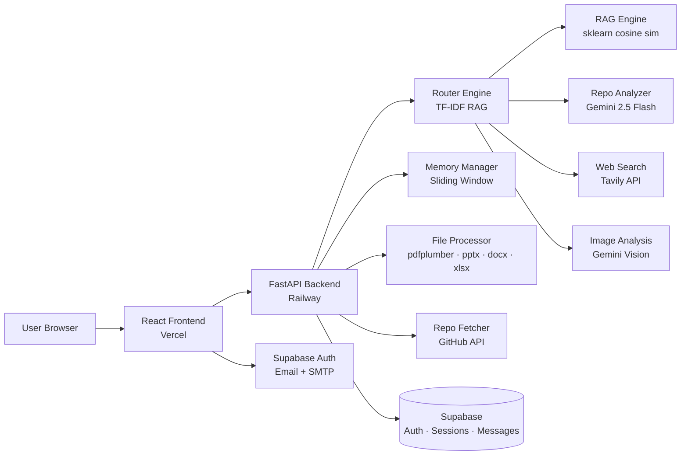

# revAi

> AI-powered GitHub repository analyzer and document intelligence platform.

Paste any GitHub URL and get instant architectural insights, code explanations, document Q&A, and web-augmented answers — all streamed in real time.

**Live:** [revai-mu.vercel.app](https://revai-mu.vercel.app)

---

## Overview

revAi is a full-stack AI chat application built around an agentic RAG pipeline. It routes every user query through a smart engine that decides whether to retrieve from uploaded documents, analyze a GitHub repository, search the web, or interpret an image — then streams the answer back token by token.

---

## Architecture



### Request Flow

```
User message
  └─ Frontend (SSE stream)
       └─ POST /chat/stream  or  /file-chat/stream
            └─ Router Engine
                 ├─ has uploaded files?  → RAG retrieval + Gemini
                 ├─ GitHub URL?          → fetch repo tree + Gemini analysis
                 ├─ /search command?     → Tavily web search + synthesis
                 ├─ image attached?      → Gemini Vision
                 └─ general query?       → Gemini with sliding-window memory
```

---

## Stack

| Layer | Technology |
|---|---|
| Frontend | React 18, CSS Modules, Supabase JS |
| Backend | FastAPI, Python 3.12, Uvicorn |
| LLM | Google Gemini 2.5 Flash |
| RAG | TF-IDF + cosine similarity (scikit-learn) |
| Web Search | Tavily API |
| Auth & DB | Supabase (email auth, custom SMTP, RLS) |
| File Parsing | pdfplumber, python-pptx, python-docx, openpyxl, pytesseract |
| Rate Limiting | SlowAPI |
| Frontend Deploy | Vercel |
| Backend Deploy | Railway (Nixpacks) |

---

## Features

- **Repo analysis** — paste any public GitHub URL, get architecture summaries, file breakdowns, and code Q&A
- **Multi-format file upload** — PDF (text + OCR fallback), PPTX, DOCX, XLSX, TXT, CSV, MD
- **Agentic RAG** — smart router selects retrieval strategy per query; TF-IDF chunked retrieval with overlap
- **Web search** — Tavily-powered live search with inline source citation chips
- **Image analysis** — Gemini Vision for screenshots, diagrams, charts
- **Streaming responses** — SSE token-by-token output with real-time UI updates
- **Conversation memory** — sliding window with Gemini summarization for long sessions
- **Session management** — rename, star, delete, search sessions; all persisted in Supabase
- **Export chat** — download sessions as Markdown, TXT, or JSON
- **Slash commands** — `/search /analyze /upload /image /clear /export /help`
- **Appearance settings** — Light / Dark / Auto theme, 4 font choices, instant apply
- **Auth** — Supabase email auth with custom SMTP confirmation emails

---

## Project Structure

```
revAi/
├── frontend/
│   ├── public/
│   │   ├── index.html          # theme bootstrap script (no flash)
│   │   └── favicon.svg
│   └── src/
│       ├── App.js              # main app, streaming logic, session state
│       ├── components/
│       │   ├── sidebar.js      # session list, rename/star/delete, search
│       │   ├── ChatWindow.js
│       │   ├── MessageBubble.js  # markdown renderer, code blocks
│       │   ├── InputBox.js     # slash command palette, file attach dropdown
│       │   ├── FileUploadModal.js
│       │   ├── AuthModal.js
│       │   ├── SettingsModal.js  # General / Appearance / Account / Privacy tabs
│       │   ├── UserProfile.js
│       │   ├── supabase.js     # client init
│       │   └── supabaseDb.js   # session/message CRUD helpers
│       └── Styles/
│           ├── layout.css      # CSS variables, theme tokens, welcome screen
│           ├── chat.css        # message rows, markdown styles
│           ├── input.css       # input box, slash palette, send button
│           └── SideBar.css     # sidebar, session items, context menu
│
└── backend/
    ├── app.py                  # FastAPI app, CORS, all endpoints
    ├── router_engine.py        # agentic query router + streaming orchestrator
    ├── rag_engine.py           # TF-IDF indexer + cosine similarity retrieval
    ├── analyzer.py             # GitHub repo analysis with Gemini
    ├── repo_fetcher.py         # GitHub API: branches, file tree, raw content
    ├── file_processor.py       # upload save + multi-format text extraction
    ├── memory_manager.py       # sliding window + Gemini summarization
    ├── web_search_tool.py      # Tavily search wrapper
    ├── requirements.txt
    └── railway.toml
```

---

## API Endpoints

| Method | Path | Description |
|---|---|---|
| `POST` | `/chat/stream` | Streaming repo/general chat (SSE) |
| `POST` | `/file-chat/stream` | Streaming chat over uploaded files (SSE) |
| `POST` | `/upload` | Upload single file to session |
| `POST` | `/upload/multi` | Upload multiple files to session |
| `POST` | `/image-chat` | Gemini Vision image analysis |
| `GET` | `/repo/tree` | List repo branches + file tree |
| `GET` | `/repo/branches` | List repo branches |
| `GET` | `/session/{id}/files` | Get files uploaded in session |
| `DELETE` | `/session/{id}` | Clear session context |
| `GET` | `/health` | Health check |

---

## Local Setup

### Prerequisites

- Python 3.10+
- Node.js 18+
- Supabase project (free tier works)
- Google Gemini API key
- Tavily API key (free tier: 1000 searches/month)
- GitHub personal access token (for private repos / higher rate limits)

### Backend

```bash
cd backend
python -m venv venv
venv\Scripts\activate        # Windows
# source venv/bin/activate   # Linux/Mac

pip install -r requirements.txt

# Create .env file:
# GEMINI_API_KEY=...
# GITHUB_TOKEN=...
# TAVILY_API_KEY=...
# ALLOWED_ORIGINS=http://localhost:3000

uvicorn app:app --host 0.0.0.0 --port 8000 --reload
```

### Frontend

```bash
cd frontend
npm install

# Create .env file:
# REACT_APP_SUPABASE_URL=https://yourproject.supabase.co
# REACT_APP_SUPABASE_ANON=your-anon-key
# REACT_APP_API=http://localhost:8000

npm start
```

---

## Deployment

### Backend → Railway

1. Connect your GitHub repo to Railway
2. Set **Root Directory** to `backend`
3. Set **Start Command** to `uvicorn app:app --host 0.0.0.0 --port $PORT`
4. Add environment variables:

```
GEMINI_API_KEY=...
GOOGLE_API_KEY=...
GITHUB_TOKEN=...
TAVILY_API_KEY=...
ALLOWED_ORIGINS=*
```

### Frontend → Vercel

1. Connect your GitHub repo to Vercel
2. Set **Root Directory** to `frontend`
3. Add environment variables:

```
REACT_APP_SUPABASE_URL=https://yourproject.supabase.co
REACT_APP_SUPABASE_ANON=your-anon-key
REACT_APP_API=https://your-service.up.railway.app
```

### Supabase Configuration

In Authentication → URL Configuration:
- **Site URL:** `https://your-frontend.vercel.app`
- **Redirect URLs:** `https://your-frontend.vercel.app/**`

Database schema:

```sql
-- Sessions table
create table sessions (
  id uuid primary key default gen_random_uuid(),
  user_id uuid references auth.users(id) on delete cascade,
  title text default 'New chat',
  starred boolean default false,
  created_at timestamptz default now(),
  updated_at timestamptz default now()
);

-- Messages table
create table messages (
  id uuid primary key default gen_random_uuid(),
  session_id uuid references sessions(id) on delete cascade,
  role text check (role in ('user', 'assistant')),
  content text,
  created_at timestamptz default now()
);

-- Enable RLS
alter table sessions enable row level security;
alter table messages enable row level security;

create policy "Users own their sessions"
  on sessions for all using (auth.uid() = user_id);

create policy "Users own their messages"
  on messages for all using (
    session_id in (select id from sessions where user_id = auth.uid())
  );
```

---

## Environment Variables Reference

| Variable | Where | Description |
|---|---|---|
| `GEMINI_API_KEY` | Railway | Google Gemini API key |
| `GOOGLE_API_KEY` | Railway | Same key (some SDK versions need both) |
| `GITHUB_TOKEN` | Railway | GitHub PAT for repo access |
| `TAVILY_API_KEY` | Railway | Tavily web search key |
| `ALLOWED_ORIGINS` | Railway | CORS origins (`*` for open, or your Vercel URL) |
| `REACT_APP_SUPABASE_URL` | Vercel | Supabase project URL |
| `REACT_APP_SUPABASE_ANON` | Vercel | Supabase anon/public key |
| `REACT_APP_API` | Vercel | Railway backend URL |

---

## Known Limitations

- Uploaded files are stored in `/tmp` on Railway — they reset on container restart. For persistence, wire `file_processor.py` to upload to Supabase Storage.
- Session memory is in-process Python dicts — also resets on restart. For persistence, move to Supabase or Redis.
- OCR on scanned PDFs requires Tesseract to be installed in the Railway Nixpack (add `tesseract` to `nixpacks.toml` packages if needed).
- GitHub rate limit is 60 req/hour unauthenticated; set `GITHUB_TOKEN` to get 5000/hour.
- Gemini 2.5 Flash has a 1M token context window but very large repos may need chunking.

---

## Legal

This project is independent and not affiliated with Google, GitHub, or Supabase.
All trademarks belong to their respective owners.